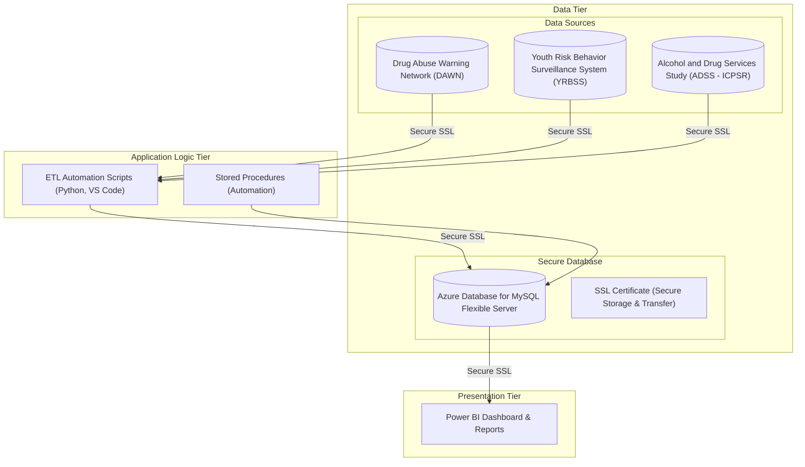

# WRITTEN FOR MERMAID.LIVE

```mermaid
graph TD

subgraph Data Tier
    subgraph Data Sources
        DAWN[("Drug Abuse Warning Network (DAWN)")]
        YRBSS[("Youth Risk Behavior Surveillance System (YRBSS)")]
        ADSS[("Alcohol and Drug Services Study (ADSS - ICPSR)")]
    end

    subgraph Secure Database
        AzureMySQL[(Azure Database for MySQL Flexible Server)]
        SSL_Cert["SSL Certificate (Secure Storage & Transfer)"]
    end
end

subgraph Application Logic Tier
    Python_ETL["ETL Automation Scripts (Python, VS Code)"]
    Stored_Procedures["Stored Procedures (Automation)"]
end

subgraph Presentation Tier
    PowerBI["Power BI Dashboard & Reports"]
end

DAWN -->|Secure SSL| Python_ETL
YRBSS -->|Secure SSL| Python_ETL
ADSS -->|Secure SSL| Python_ETL

Python_ETL -->|Secure SSL| AzureMySQL
Stored_Procedures --> AzureMySQL
AzureMySQL -->|Secure SSL| PowerBI
```
